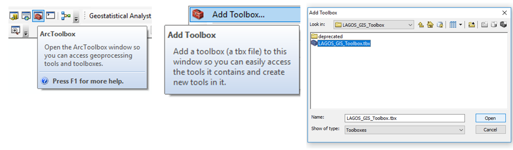

LAGOS GIS Toolbox
===================

This is an ArcGIS toolbox for landscape limnology created from a collection of Python script tools. It was used to create the [LAGOS-US database](https://lagoslakes.org/).

## Releases & Citation
Release [v2.0](https://github.com/cont-limno/LAGOS_GIS_Toolbox/tree/v2.0) corresponds to the methods documented with the release of the LAGOS-US LOCUS and GEO modules

LOCUS Data citation:
Smith, N.J., K.E. Webster, L.K. Rodriguez, K.S. Cheruvelil, and P.A. Soranno. 2021. LAGOS-US LOCUS v1.0: Data module of location, identifiers, and physical characteristics of lakes and their watersheds in the conterminous U.S. ver 1. Environmental Data Initiative. https://doi.org/10.6073/pasta/e5c2fb8d77467d3f03de4667ac2173ca (Accessed 2021-12-13).

Data paper citation:
Cheruvelil, K.S., Soranno, P.A., McCullough, I.M., Webster, K.E., Rodriguez, L.K. and Smith, N.J. (2021), LAGOS-US LOCUS v1.0: Data module of location, identifiers, and physical characteristics of lakes and their watersheds in the conterminous U.S. Limnol Oceanogr Letters 6: 270-292. https://doi-org.proxy1.cl.msu.edu/10.1002/lol2.10203

GEO Data citation
Smith, N.J., K.E. Webster, L. Rodriguez, K.S. Cheruvelil, and P.A. Soranno. 2021. LAGOS-US GEO: Data module of lake geospatial ecological context at multiple spatial and temporal scales in the conterminous U.S. Environmental Data Initiative. https://doi.org/??????. Dataset accessed XX/XX/2022.

Release [v1.0](https://github.com/cont-limno/LAGOS_GIS_Toolbox/tree/v1.0) corresponds to the methods documented in the following manuscript:

Soranno, P. A., Bissell, E. G., Cheruvelil, K. S., Christel, S. T., Collins, S. M., Fergus, C. E., ... & Scott, C. E. (2015). Building a multi-scaled geospatial temporal ecology database from disparate data sources: fostering open science and data reuse. *GigaScience, 4*(1), 28.

## Requires
* Spatial Analyst extension (some tools)
* ArcGIS 10.3 or higher
* [Taudem](http://hydrology.usu.edu/taudem/taudem5/index.html) tool suite (some tools).
## Installation

* Open the ArcToolbox Pane

* Right click to access the Add Toolbox command

* Navigate to `LAGOS_GIS_Toolbox.tbx`

* (Optional) Right click on ArcToolbox root, then click "Save Settings > To Default" to save this toolbox to your default tools

## Tools
**Lake Analysis**
* Lake Connectivity Classification
* Upstream Lakes

**Summarize Data by Zones**
* Flatten Overlapping Zones
* LAGOS-US Lake Density
* LAGOS-US Stream Density
* Line Density in Zones
* Point Attribution of Raster Data
* Point Density in Zones
* Polygon Density in Zones
* Pre-process PAD-US Dataset
* Rasterize Zones
* Zonal Summary of Classed Polygons
* Zonal Summary of Raster Data

**Utilities**
* Export to CSV
* Merge NHD Features without Deduplication
* Test LAGOS GIS Toolbox

**Watershed Delineation**
Plus-01. Add Waterbody NHDPlusID
Plus-02. Update Grid Codes
Plus-03. Add Lake Seeds (Pour Points/Outlets)
Plus-04. Revise HydroDEM
Plus-05. TauDEM Pit Remove
Plus-06. Flow Direction
Plus-07. Delineate Catchments
Plus-08. Aggregrate Watersheds

---

The toolbox is not formally supported. You can direct questions to the project PI, Kendra Cheruvelil (ksc@msu.edu).

